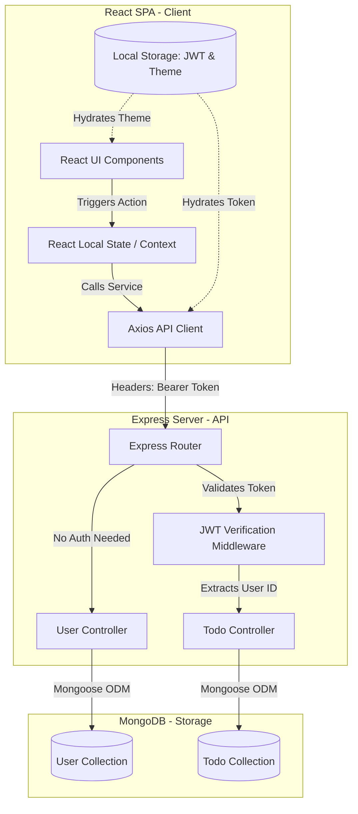

# TaskFlow — Production-Ready MERN Stack Task Management System

[](https://nodejs.org/)
[](https://react.dev/)
[](https://www.mongodb.com/)
[](https://opensource.org/licenses/ISC)

TaskFlow is a robust, full-stack task management application designed with a focus on data security, state management, and real-time dashboard analytics. Built using the **MERN (MongoDB, Express, React, Node.js)** stack, the application showcases industry-standard engineering practices including RESTful API design, token-based authentication (JWT), secure database schema modeling, and client-side reactive components.

---

## 🏗️ System Architecture & Data Flow

TaskFlow follows a decoupled client-server architecture. The frontend React application manages user interactions, client-side route guards, and UI state, while the Node.js/Express backend handles business logic, security middleware, and database operations.



---

## ⚡ Core Engineering Achievements & Contributions

### 1. Secure Authentication & Session Isolation
*   **Encrypted Storage**: Secured user credentials using **Bcrypt.js** to run one-way salt-rounds (10 rounds) hash encryption hooks on model pre-save triggers.
*   **Stateless Sessions**: Implemented bearer token authorization using **JSON Web Tokens (JWT)**. Validated API requests using a customizable token extraction middleware that inspects HTTP headers to inject user contexts securely into subsequent controller scopes.
*   **Database Isolation**: Designed schemas such that tasks are linked directly to `User` database ObjectIds (`ref: 'users'`), ensuring strict multi-tenant boundary checks.

### 2. Reactive UI State & Client-Side Logic
*   **Dynamic Dashboard Metrics**: Leveraged React hooks to compute real-time statistics (total tasks, completed, pending) instantly as tasks undergo CRUD operations, avoiding expensive database re-queries.
*   **Predictive Overdue Scheduler**: Built client-side datetime comparison logic comparing deadlines (`dueDate`) against current local timestamps. Implemented a system warning state (rendering dynamic alerts and special `overdue` UI classes) for incomplete items past their deadlines.
*   **State-Hydrated Theming**: Implemented client-side dark-mode toggling, binding state updates directly to browser document bodies and utilizing `localStorage` caching to eliminate flashing during initial page loads.

### 3. API Performance & Code Organization
*   **RESTful Best Practices**: Maintained a clean router structure organizing routes by resource endpoints (`/api/v1/user`, `/api/v1/todo`) and isolating routing tables from controller logical implementations.
*   **Database Indexes & Pagination**: Seeded strict validators on Mongoose schemas to check format compliance (e.g., regex checks on email fields) and utilized Mongo indexing features like `unique: true` to prevent double-submissions.
*   **Workspace Optimization**: Set up a unified repository developer framework using `Concurrently` to execute React dev scripts and Nodemon backend listeners in a single, parallel terminal workflow.

---

## 💾 Database Schema Design

TaskFlow utilizes **MongoDB** structured through **Mongoose ODM** to enforce validation rules at the server level.

### User Schema (`users`)
Holds credential details, automatically hashes passwords, and sanitizes input fields.
```javascript
{
  username: { type: String, required: true, trim: true, minlength: 3, maxlength: 30 },
  email:    { type: String, required: true, unique: true, lowercase: true, trim: true, match: [/^\S+@\S+\.\S+$/, "Please use a valid email"] },
  password: { type: String, required: true, minlength: 6 }
}
// Timestamps: createdAt, updatedAt are generated automatically
```

### Todo Schema (`todos`)
Links to the User Schema to implement access control and track task details.
```javascript
{
  title:       { type: String, required: true, trim: true, minlength: 3, maxlength: 100 },
  description: { type: String, required: true, trim: true, minlength: 5, maxlength: 500 },
  isCompleted: { type: Boolean, default: false },
  createdBy:   { type: mongoose.Schema.Types.ObjectId, ref: "users", required: true },
  priority:    { type: String, enum: ["low", "medium", "high"], default: "low" },
  dueDate:     { type: Date }
}
// Timestamps: createdAt, updatedAt are generated automatically
```

---

## 🔌 API Documentation

All request bodies and responses are served in JSON format.

### 1. User Services (`/api/v1/user`)
*   **Register User**
    *   `POST /register`
    *   **Payload**: `{ "username": "JohnDoe", "email": "john@example.com", "password": "securePassword" }`
    *   **Response (201)**: `{ "success": true, "message": "User registered successfully", "user": { ... } }`
*   **Login User**
    *   `POST /login`
    *   **Payload**: `{ "email": "john@example.com", "password": "securePassword" }`
    *   **Response (200)**: `{ "success": true, "message": "Login successful", "token": "JWT_TOKEN", "user": { "id": "USER_ID", "username": "JohnDoe" } }`

### 2. Task Services (`/api/v1/todo`)
*   **Create Task**
    *   `POST /create`
    *   **Headers**: `Authorization: Bearer <token>`
    *   **Payload**: `{ "title": "Setup Server", "description": "Initialize database connection", "createdBy": "USER_ID", "priority": "high", "dueDate": "2026-07-01T12:00:00.000Z" }`
    *   **Response (201)**: `{ "success": true, "message": "Task created successfully", "todo": { ... } }`
*   **Fetch Tasks**
    *   `GET /get/:userId`
    *   **Headers**: `Authorization: Bearer <token>`
    *   **Response (200)**: `{ "success": true, "message": "Todos fetched successfully", "todos": [ ... ] }`
*   **Update Task**
    *   `PUT /update/:id`
    *   **Headers**: `Authorization: Bearer <token>`
    *   **Payload**: `{ "isCompleted": true, "priority": "medium" }` (Allows partial updates)
    *   **Response (200)**: `{ "success": true, "message": "Task updated successfully", "todo": { ... } }`
*   **Delete Task**
    *   `DELETE /delete/:id`
    *   **Headers**: `Authorization: Bearer <token>`
    *   **Response (200)**: `{ "success": true, "message": "Task deleted successfully" }`

---

## 🛠️ Local Setup & Configuration

Follow these steps to run the application in a local development environment.

### 1. Configure the Environment
Create a `.env` configuration file in the project's root folder (`TODO-MERN-Stack-APP/`):
```env
PORT=5000
MONGO_URI=mongodb://127.0.0.1:27017/todo-app
DEV_MODE=development
JWT_SECRET=your_secret_key_here
```

### 2. Install Project Dependencies
Initialize dependencies for the Express backend and React frontend:
```bash
# Install backend dependencies in root directory
npm install

# Navigate to client directory and install frontend dependencies
cd client
npm install

# Return to root directory
cd ..
```

### 3. Start Development Servers
Run the following script in the root directory to initiate concurrent execution:
```bash
npm run dev
```
The React development server will start on [http://localhost:3000](http://localhost:3000) and the Express API server will listen on [http://localhost:5000](http://localhost:5000).
